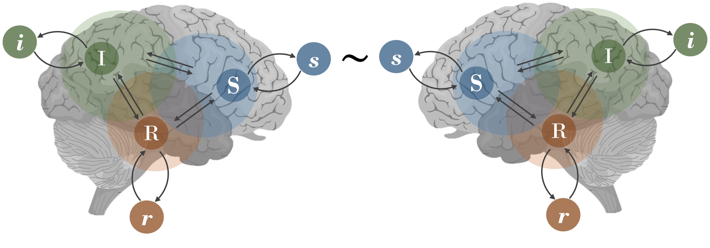
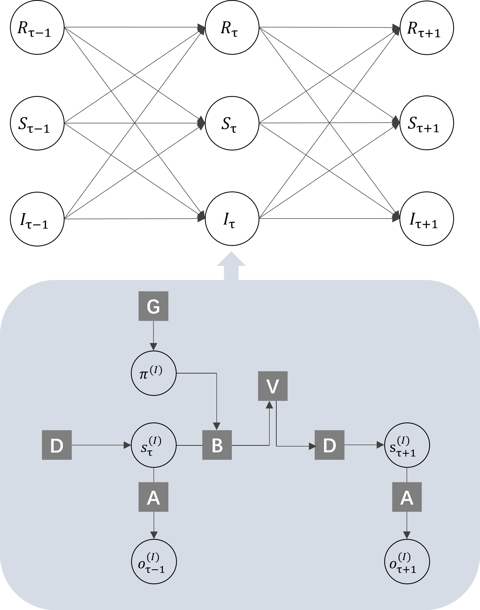

# An active inference model of Lacanian psychoanalysis
<p align='center'>
  

There has been a growing interest in exploring behavior, brain, and mind through the lens of complex systems theory. However, a unified and computational model that comprehensively encapsulates the properties of the human mind remains elusive. To address this gap, we propose a recurrent generative model drawing upon with Lacanian psychoanalysis and active inference. This model involves three interconnected sub-systems corresponding to three registers in Lacanian theory: the Real (R), Symbolic (S), and Imaginary (I). Every sub-system entails an active inference agent, and their interconnectivity stems from the global propagation of free energy.  We here provide a Jupyter Notebook which simulate the dynamics of this model, utilizing the Python package - [`Pymdp`](https://github.com/infer-actively/pymdp/).

<p align='center'>
  
</p>

For more information, please read our [paper](https://doi.org/10.3389/fpsyg.2025.1574650) :
```
@article{li16formalizing,
  title={Formalizing Lacanian Psychoanalysis Through the Free Energy Principle},
  author={Li, Lingyu and Li, Chunbo},
  journal={Frontiers in Psychology},
  volume={16},
  pages={1574650},
  publisher={Frontiers}
}
```
